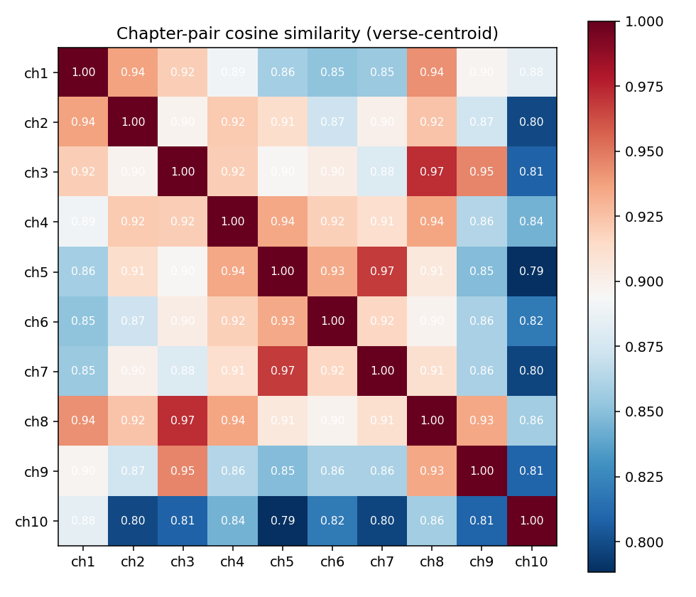

# Chapter 4 — Interlude A: The Chiastic Mirror
### What the embedding space has to say about chapter-level structure

---

We trained the embeddings in the previous chapter to use as features for our classifier. They also let us answer a different question — one that has nothing to do with masking names.

Megillat Esther is famously built on mirrors. The two royal decrees in chapters 3 and 8 are deliberately parallel: same form (the king's ring, the same scribes, the runners on horseback), inverted content (destroy the Jews / let the Jews defend themselves). The two banquets in chapters 5 and 7 are similarly twinned: same setting, same guest list of three, opposite outcomes. The book is composed as a chiasm and the structure has been catalogued by Sages and modern scholars alike.

The narrower question for this chapter: can the embedding space we trained for our classifier pick up this chapter-level mirror structure, with no notion of plot or character?

---

## The experiment

For each of the ten chapters, take every Word2Vec token vector in that chapter and average them into a single 50-dimensional point. Call this the *chapter centroid* — a numerical summary of what the chapter is "about," in vocabulary terms. Then compute the cosine similarity between every pair of chapter centroids. You get a 10×10 matrix.

Run the whole thing with five different random seeds. Average the matrices.

The two darkest off-diagonal cells in the heatmap are:

| Pair | mean cosine (5 seeds) | std |
|---|---:|---:|
| **ch3 ↔ ch8** | **0.973** | 0.002 |
| **ch5 ↔ ch7** | **0.967** | 0.001 |

The standard deviation across seeds is around 0.002. There is essentially no noise. These are the same two pairs Sages and scholars have been pointing at for centuries.

A few weaker but still real signals:

| Pair | mean cosine |
|---|---:|
| ch1 ↔ ch8 (feast register meets administrative register) | 0.949 |
| ch3 ↔ ch9 (decree day announced ↔ day the decree is fulfilled) | 0.944 |

And — critically — a chapter pair that is *not* a known mirror:

| Pair (control) | mean cosine |
|---|---:|
| ch5 ↔ ch9 (banquet vs Purim feast) | **0.819** |

The drop is clean. We are not measuring "everything is similar to everything." We are measuring something specific.

---

## What the model is actually doing

A chapter centroid is a coarse instrument. It throws away word order, throws away grammar, throws away the difference between subject and object. All it preserves is *which vocabulary lives in this chapter, in what proportion*. The model is not reading the chapters; it is taking their vocabulary-fingerprint.

That this is enough to rediscover the mirrors tells us something concrete about the book's composition. The author of Esther did not just *theme* the parallels — *"let chapter 8 be the inverse of chapter 3"*. The author **lexically rebuilt** the mirror chapter with the parallel chapter's vocabulary, then inverted the content. The ring transfers in the same words. The runners go out on horses in the same words. The structure of the king's decree is repeated nearly verbatim. The parallel is in the surface text, not just in the underlying plot — and the surface text is the only thing the model sees.

The same is true for the banquets. The phrasing `יבוא המלך והמן` is repeated. The dialogue formulas — `מה שאלתך`, `עד חצי המלכות` — recur. The compositional intent is on the page, in the choice of words.

This is why the chapter centroid finds it. The author left the mirror structure in the vocabulary.

---

## What the model can't see

The model has not "understood" the chiasm. It does not know that chapter 8 inverts chapter 3 in meaning. It only knows that chapter 8 *resembles* chapter 3 in vocabulary. The inversion — that the decree to destroy becomes the decree to defend — is invisible to it. What the model detects is the *form* of the mirror, not its semantic content. Same form, opposite meaning is exactly the structure the model is blind to: it cannot tell the two decrees apart on the question of who lives and who dies.

This same blind spot — the technique seeing form but not inversion — is the subject of the optional [appendix](appendix-replacement-parallel.md), which tests the analogous claim about characters and reports a clean negative.

## And the commercial LLMs?

Asked about the chiastic structure of Esther, ChatGPT or Claude would produce a fluent answer mentioning chapters 3 and 8, the two banquets, the ring transfer. The mechanism is different from ours. They are repeating analyses written by human commentators in their training data — Talmudic literature, modern biblical scholarship, study guides. Our small system rediscovers the chiasm from the text alone, with no commentary in scope. The two outputs may look similar; the operations are not. *Quoting an analysis* is not the same as *computing it*. For texts the commercial models have never seen — an unpublished modern novel, say, or a private corpus — they would have nothing to quote. The pipeline in this chapter would work on such a text the same way it works here.

→ [Interlude B — The Honor That Flips](05-the-honor-that-flips.md)

---

**Interactive Walkthrough:** [04_chiastic_mirror.ipynb](file:///g:/האחסון%20שלי/learning/Nebius/LLM_Architecture/Ex2/repo-draft/notebooks/04_chiastic_mirror.ipynb)  
**Code Implementation:** [analysis.py](file:///g:/האחסון%20שלי/learning/Nebius/LLM_Architecture/Ex2/repo-draft/src/esther_nlp/analysis.py)
