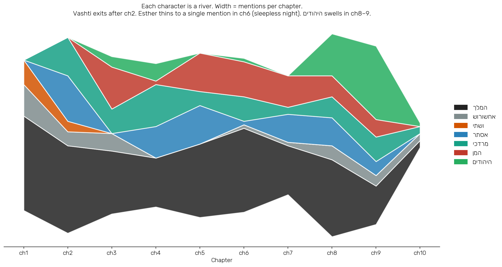

# Chapter 6 — The Cast Shifts
### What the narrator chose to call each character, and when

---

Before we mask names and train the classifier, one more piece of background: where each character actually appears in the book. Drop the embeddings for a moment and use a cruder instrument — counting. For each main character, tally how many times their name appears in each chapter, including the BPE-prefixed forms the tokenizer produces (`והמן`, `למרדכי`, `ולאסתר`, and so on). The result is a 7×10 grid.

| Character | ch1 | ch2 | ch3 | ch4 | ch5 | ch6 | ch7 | ch8 | ch9 | ch10 |
|---|---:|---:|---:|---:|---:|---:|---:|---:|---:|---:|
| המלך | 27 | 25 | 18 | 14 | 21 | 24 | 14 | 22 | 11 | 2 |
| אחשורוש | 9 | 4 | 5 | **0** | **0** | 1 | 1 | 4 | 3 | 2 |
| ושתי | 7 | 3 | — | — | — | — | — | — | — | — |
| אסתר | — | 13 | — | 9 | 11 | **1** | 8 | 8 | 4 | — |
| מרדכי | — | 11 | 7 | 12 | 4 | 7 | 2 | 6 | 7 | 2 |
| המן | — | — | 12 | 1 | 11 | 10 | 9 | 6 | 5 | — |
| היהודים | — | — | 3 | 5 | — | 1 | — | **12** | **21** | 1 |

Three things in this table that the narrative reading already knows but does not usually quantify.

---

## The man loses his name

`אחשורוש` — the personal name of the king — has 9 mentions in chapter 1, then drops to 4, 5, **0, 0** for chapters 4 and 5. He never recovers. From chapter 4 onward, the character with the longest title in the Tanakh ("king from India to Cush, of one hundred and twenty-seven provinces") is referred to almost exclusively as `המלך`. The narrator stops calling him a person.

This is a compositional decision, not a historical one. There is no plausible reading on which the historical Achashverosh (or whichever Persian monarch the book is built around) stopped having a name in the middle of his reign. The author of the Megillah simply *chose* to use his personal name heavily in the opening chapters and to retire it once the more important narrative engine had been built — the institutional King who orbits Haman, then Mordecai. The man becomes the office. You can read this decision off the table without opening the book.

It also explains the most counterintuitive number in Chapter 3 of this repo. When we asked the embedding model who sits closest to `המלך`, Achashverosh ranked 218th out of 640 — far below Haman, Esther, Mordecai, the queen. The reason is here. By the time the book has finished, `אחשורוש` has appeared 29 times and `המלך` has appeared 178 times. They are not the same token. They never had a chance to be.

---

## The protagonist is absent from the pivot

Look at Esther's row. She has 13 mentions in chapter 2 (her entry), 9 in chapter 4 (the sackcloth dialogue with Mordecai), 11 in chapter 5 (the first banquet). Then **one** mention in chapter 6. Then 8 in chapter 7.

Chapter 6 is the pivot of the book — the sleepless night, the chronicles read aloud, the king's discovery that Mordecai's loyalty was never rewarded. It is the chapter that turns the entire plot around. And the protagonist is offstage for almost all of it. The single mention of Esther in chapter 6 is the verse where Haman is summoned to the inner court (`והנה המן עמד בחצר`) — she is not present, not speaking, not even named except in passing.

This is a precise compositional fact. The chapter that saves the heroine is the chapter the heroine is not in. A reader who notices this is reading the book the way the author wrote it: the moment of redemption belongs to no character in particular — to the king's insomnia, to the chronicler's clerk, to the chronicle itself. The hero does not have to be present at the moment of the inversion.

---

## The protagonist changes

The bottom row is the most striking. `היהודים` — the Jews, the collective people — has 0–5 mentions per chapter through chapter 6. Then it jumps to **12** in chapter 8 and **21** in chapter 9. The total in just those two chapters is 33 — more than Esther's count for the entire book (54), close to Mordecai's (58).

The book starts as court intrigue: a king, a queen, a banishment. It develops into personal drama: a Jew at the gate, an orphan at the palace, an enemy at the council. It ends as national history: a people defending themselves across the empire, a people instituting a holiday. The genre of the book changes under the reader's feet, and the change is precisely measurable in the count of names.

This may be the deepest of the three readings. The Megillah opens as a story about individual people and ends as a story about a *people*. The narrator does not announce this shift; he just stops giving every scene a named protagonist and starts referring to the actor collectively. By chapter 9 the actor of the book is no longer Esther or Mordecai or Haman; it is `היהודים`, who fight, who rest, who establish, who write. The book of Esther is not really about Esther by its final chapter. It is about the people she made it possible to save.

---

## What the model can't see

These counts are mention counts. They are not arguments about what happened in fifth-century BCE Susa, and they are not arguments about what any of the characters actually did. They are evidence about which name the *narrator* chose to use in which scene. Esther's absence from chapter 6 is a literary fact about composition; it tells us nothing about whether a historical Esther was elsewhere, or asleep, or in prayer that night. The book is built a certain way; the table is a record of how.

The other limit is sharper. Counts treat all occurrences of a name as equivalent. The mention of Haman in `ויתלו את המן` (they hanged Haman) and the mention in `ויספר להם המן את כבוד עשרו` (and Haman told them of the glory of his wealth) are both `1` in the same row of the table. The arc inside the character (rise → fall) is invisible to counting. The embeddings of Stage 3 are the finer instrument. Both are partial.

## And the commercial LLMs?

Ask ChatGPT, Gemini, or Claude to describe the cast of Esther and you will get a narrative paragraph. None of them will produce a 7×10 grid of mention counts per chapter unless you specifically ask for one. Commercial LLMs are biased toward narrative summary over measurement — they were trained on text that mostly tells stories about books, not text that measures books. For the findings in this chapter — Esther absent from chapter 6, `אחשורוש` losing his name after chapter 3, `היהודים` taking over as protagonist — the impressionistic mode tends to miss what counting reveals. The simple instrument outperforms the powerful one because it asks a more precise question.

---

## On to the classifier

We now have everything we need for the masking task: a tokenizer (Stage 2), an embedding space (Stage 3), and a sense of where each character actually appears (this chapter). The next stage masks names and trains a classifier to predict which character was hidden.

→ [Stage 7 — The Classifier](07-the-classifier.md)

---

**Interactive Walkthrough:** [06_cast_shifts.ipynb](../notebooks/06_cast_shifts.ipynb)  
**Code Implementation:** [plots.py (streamgraph)](../src/esther_nlp/plots.py)
